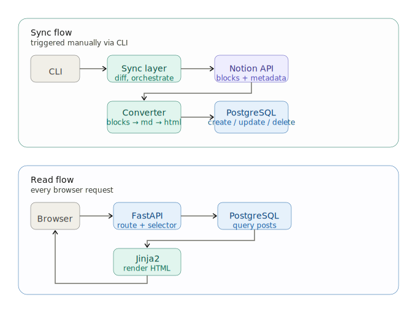

# Ivan's Blog

> Personal technical blog with Notion as its content workspace.
> Posts are written and managed in Notion, then synced to a local PostgreSQL database and served via FastAPI + Jinja2.
> Notion is the source of truth — the database functions as a read cache, not a content store.


---

## Key Decisions

These are the non-obvious design choices that shaped the system.

### Why FastAPI + SQLAlchemy instead of Django?

Django was intentionally avoided to understand what it abstracts. Using SQLAlchemy directly exposed the engine/session lifecycle, Unit of Work pattern, and migration mechanics that Django's ORM handles transparently. The friction was the point.

### Why markdown as an intermediate step?

Notion blocks are converted to Markdown (stored in content_markdown) rather than directly to HTML. Markdown is portable and readable outside the rendering pipeline — if the HTML renderer changes, content doesn't. content_html is a derived column, computed at sync time from content_markdown and never edited directly.

### Why notion as the primary source?

The sync layer treats Notion as the authoritative source. If a post exists in the database but not in Notion, it gets deleted. If content differs, Notion wins. The database exists to serve reads efficiently, not to own content.

## System Architecture



## Quick Start

### Prerequisites

- Python 3.14+
- [uv](https://docs.astral.sh/uv/)
- Docker & Docker Compose

### Setup

#### 1. Clone and install dependencies

```bash
git clone <repo-url>
cd blog
uv sync
```

#### 2. Configure environment variables

```bash
cp .env.example .env
```

| Variable | Description |
| --- | --- |
| `DATABASE_URL` | PostgreSQL connection string |
| `NOTION_TOKEN` | Notion integration token |
| `NOTION_DATA_SOURCE_ID` | ID of your Notion data source |

To get the Notion token see [Notion API getting started](https://developers.notion.com/docs/getting-started) to create an integration and get your token.

The `NOTION_DATA_SOURCE_ID` is **not** the database ID visible in the Notion URL.
It must be retrieved via the Notion API (`notion.data_sources.list()`).

The sync commands expects an inline-database element in the main page from where the Token is config + the exact properties that the "Notion Setup" section describes.

#### 3. Start the database

```bash
docker compose up -d
```

#### 4. Run migrations

 ```bash
uv run alembic upgrade head
```

#### 5. Sync content from Notion

```bash
uv run python cli.py sync
```

#### 6. Start the development server

```bash
uv run fastapi dev app/main.py
```

### CLI Commands

| Command | Description |
| --- | --- |
| `python cli.py sync` | Sync posts from Notion (creates, updates, deletes) |
| `python cli.py backfill-db` | Recompute `content_html` from `content_markdown` |

---

### Notion setup

The sync layer expects a Notion database with the following properties:

| Property | Type | Notes |
| --- | --- | --- |
| `Titulo` | Title | Post title |
| `slug` | Rich text | URL-friendly identifier |
| `Estado` | Status | Only `Published` posts are synced |
| `categoria` | Select | Required — posts without category are skipped |
| `Fecha Publicacion` | Date | Publication date |
